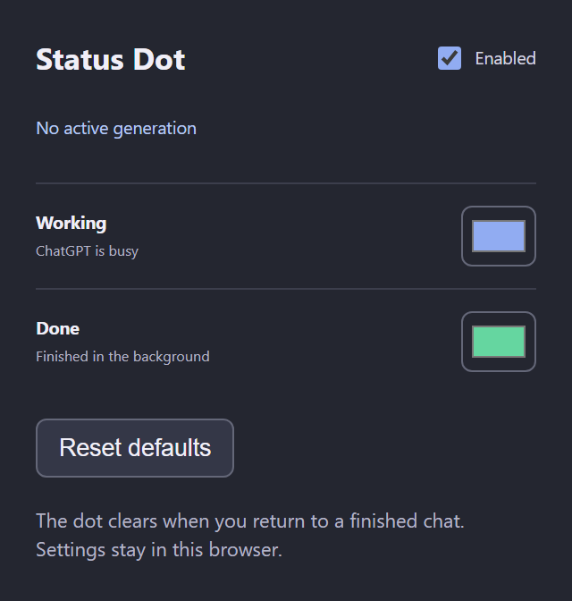

# ChatGPT Status Dot

See when ChatGPT finishes without switching back to the chat.

**[Download for Chrome](https://github.com/Hxtomi/ChatGPT-Status-Dot/releases/latest/download/chatgpt-status-dot.zip)**

- **Blue:** ChatGPT is working.
- **Green:** a response finished while you were away.
- **No dot:** nothing is running or waiting to be read.

The dot appears on the tab icon and clears when you return to the chat. If you're already watching the response, it clears as soon as the answer finishes.

## Install

1. Download the ZIP above and extract it into a permanent folder.
2. Open `chrome://extensions` and turn on **Developer mode**.
3. Click **Load unpacked** and select the extracted folder containing `manifest.json`.

Using the source code instead? Select its `extension` folder.

## Choose your colors

Open **ChatGPT Status Dot** from Chrome's extensions menu to change either color, switch the indicator off, or reset the defaults.

Keep the chat tab open while you wait. Reloading it clears the unread indicator.

## Privacy

Your settings stay in your browser. The extension doesn't collect your conversations or use analytics. [Privacy details](PRIVACY.md).

[Report a bug](https://github.com/Hxtomi/ChatGPT-Status-Dot/issues) · [Developer guide](docs/development.md) · [Apache-2.0](LICENSE)

Not affiliated with OpenAI.
